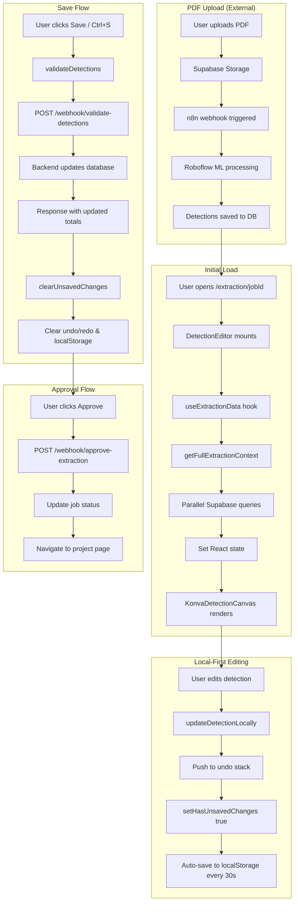

# Detection Editor Frontend Analysis

> **Generated**: 2025-01-09
> **Status**: Documentation Only - No Changes Made

---

## Table of Contents

1. [File Structure](#1-file-structure)
2. [Data Flow](#2-data-flow)
3. [Detection Data Structure](#3-detection-data-structure)
4. [Canvas Implementation](#4-canvas-implementation)
5. [API Integration](#5-api-integration)
6. [Current State vs Spec](#6-current-state-vs-spec)
7. [Gaps & Issues](#7-gaps--issues)

---

## 1. File Structure

### Detection Editor Components

```
components/detection-editor/
├── index.ts                          # Component exports
├── DetectionEditor.tsx               # Main orchestrator (1,679 lines)
├── KonvaDetectionCanvas.tsx          # Canvas rendering engine (953 lines)
├── KonvaDetectionPolygon.tsx         # Polygon shape rendering
├── KonvaDetectionLine.tsx            # Line measurement rendering
├── KonvaDetectionPoint.tsx           # Point/marker rendering
├── KonvaDetectionRect.tsx            # Rectangle shapes (legacy)
├── DetectionCanvas.tsx               # Legacy canvas (deprecated)
├── DetectionBox.tsx                  # Individual detection visual
├── DetectionToolbar.tsx              # Top toolbar
├── MarkupToolbar.tsx                 # Left sidebar tool buttons
├── DetectionSidebar.tsx              # Right sidebar (pages, detections, properties)
├── CalibrationModal.tsx              # Scale calibration dialog
└── PropertiesPanel/
    ├── index.tsx                     # Main properties panel
    ├── SelectionProperties.tsx       # Display measurements
    ├── ClassSelector.tsx             # Change detection class
    ├── MaterialAssignment.tsx        # Assign materials/products
    ├── NotesField.tsx                # User notes
    └── PageTotals.tsx                # Summary calculations
```

### Custom Hooks

```
lib/hooks/
├── useExtractionData.ts              # Central state management (755 lines)
├── useDetectionSync.ts               # Webhook sync & validation (575 lines)
├── useMaterialSearch.ts              # Product catalog search
└── index.ts                          # Re-exports
```

### Types & Utilities

```
lib/types/
└── extraction.ts                     # All extraction types (431 lines)

lib/utils/
├── polygonUtils.ts                   # Polygon math (area, perimeter, etc.)
└── coordinates.ts                    # Coordinate conversion utilities

lib/api/
└── extractionApi.ts                  # Extraction API client (150 lines)

lib/supabase/
├── extractionQueries.ts              # Supabase data access (608 lines)
└── pdfStorage.ts                     # PDF upload to Supabase Storage
```

### App Routes

```
app/projects/[id]/extraction/
├── [jobId]/page.tsx                  # Extraction review page
└── [jobId]/loading.tsx               # Loading state
```

---

## 2. Data Flow

### Complete Data Flow Diagram



### PDF Upload Flow

**Note**: PDF upload happens **before** the Detection Editor. The extraction job is already created when the editor loads.

1. User uploads PDF via `HoverUploadStep.tsx`
2. PDF uploaded to Supabase Storage bucket `project-pdfs`
3. n8n webhook triggered to process PDF
4. Roboflow ML runs object detection
5. Results saved to `extraction_detections` table

### Data Fetching (useExtractionData)

```typescript
// lib/hooks/useExtractionData.ts

const context = await getFullExtractionContext(jobId);
// Returns:
// - job: ExtractionJob
// - pages: ExtractionPage[]
// - detectionsByPage: Map<pageId, ExtractionDetection[]>
// - elevationCalcsByPage: Map<pageId, ExtractionElevationCalcs>
// - jobTotals: ExtractionJobTotals
```

### Edit Tracking (Undo/Redo)

- **Max Stack Size**: 50 entries
- **Auto-save to localStorage**: Every 30 seconds
- **Draft recovery**: On component mount, checks for drafts < 60 minutes old

```typescript
// State management
const [undoStack, setUndoStack] = useState<Map<string, ExtractionDetection[]>[]>([]);
const [redoStack, setRedoStack] = useState<Map<string, ExtractionDetection[]>[]>([]);

// Before each change
pushToUndoStack(); // Clones current state, adds to stack

// Undo operation
const previousState = undoStack.pop();
redoStack.push(currentState);
setDetections(previousState);
```

---

## 3. Detection Data Structure

### ExtractionDetection (Core Model)

```typescript
// lib/types/extraction.ts

interface ExtractionDetection {
  id: string;
  job_id: string;
  page_id: string;
  class: DetectionClass;
  detection_index: number;
  confidence: number;

  // Pixel coordinates (from ML model - CENTER-BASED from Roboflow)
  pixel_x: number;        // Center X
  pixel_y: number;        // Center Y
  pixel_width: number;
  pixel_height: number;

  // Real-world measurements (calculated from scale_ratio)
  real_width_in: number | null;
  real_height_in: number | null;
  real_width_ft: number | null;
  real_height_ft: number | null;
  area_sf: number | null;       // Square feet (for polygons)
  perimeter_lf: number | null;  // Linear feet (for lines)

  // Additional properties
  is_triangle: boolean;
  matched_tag: string | null;
  created_at: string;

  // Edit tracking
  status: DetectionStatus;      // 'auto' | 'verified' | 'edited' | 'deleted'
  edited_by: string | null;
  edited_at: string | null;
  original_bbox: {              // Preserved for undo
    pixel_x: number;
    pixel_y: number;
    pixel_width: number;
    pixel_height: number;
  } | null;

  // Polygon support (freeform shapes)
  polygon_points?: Array<{ x: number; y: number }> | null;

  // Markup type (determines rendering)
  markup_type?: MarkupType;     // 'polygon' | 'line' | 'point'
  marker_label?: string | null;

  // Product assignment
  assigned_material_id?: string | null;

  // User notes
  notes?: string | null;
}
```

### Detection Classes

```typescript
// User-selectable classes (shown in dropdown)
type DetectionClass =
  | 'window' | 'door' | 'garage' | 'siding' | 'roof' | 'gable'
  // Linear measurement classes (LF)
  | 'trim' | 'fascia' | 'gutter' | 'eave' | 'rake' | 'ridge' | 'soffit'
  | '';

// Internal classes (hidden from UI, used for calculations)
type InternalDetectionClass = 'building' | 'exterior_wall';
```

### Markup Types

| Type | Usage | Measurement |
|------|-------|-------------|
| `polygon` | Area measurements | Square feet (SF) |
| `line` | Linear measurements | Linear feet (LF) |
| `point` | Count markers | Count |

### polygon_points Format

```typescript
// For polygons: Array of absolute pixel coordinates
polygon_points: [
  { x: 100, y: 50 },
  { x: 200, y: 50 },
  { x: 200, y: 150 },
  { x: 100, y: 150 }
]

// For lines: 2-point array
polygon_points: [
  { x: 100, y: 50 },   // Start point
  { x: 200, y: 150 }   // End point
]

// For points: null (uses pixel_x/y only)
polygon_points: null
```

---

## 4. Canvas Implementation

### Library: Konva (React Konva)

The project uses **Konva.js** via `react-konva` for interactive canvas rendering.

```typescript
// KonvaDetectionCanvas.tsx
import { Stage, Layer, Image as KonvaImage, Line, Circle } from 'react-konva';
```

### Shape Components

| Component | File | Purpose |
|-----------|------|---------|
| `KonvaDetectionPolygon` | KonvaDetectionPolygon.tsx | Freeform polygon shapes with draggable corners |
| `KonvaDetectionLine` | KonvaDetectionLine.tsx | Two-point lines for linear measurements |
| `KonvaDetectionPoint` | KonvaDetectionPoint.tsx | Single-point markers for counting |
| `KonvaDetectionRect` | KonvaDetectionRect.tsx | Rectangle shapes (legacy) |

### Tool Modes

```typescript
type ToolMode = 'select' | 'create' | 'pan' | 'verify' | 'calibrate' | 'line' | 'point';
```

| Tool | Shortcut | Behavior |
|------|----------|----------|
| Select | `S` | Click to select, Ctrl+Click for multi-select |
| Create | `D` | Point-by-point polygon drawing |
| Line | `L` | Two-click line measurement |
| Point | `P` | Single-click point marker |
| Pan | `H` | Drag to pan viewport |
| Verify | `V` | Mark detections as verified |
| Calibrate | `C` | Two-point scale calibration |

### Selection System

```typescript
// Multi-select state
const [selectedIds, setSelectedIds] = useState<Set<string>>(new Set());

// Selection logic
const handleSelect = (id: string, addToSelection: boolean) => {
  if (addToSelection) {
    // Ctrl/Cmd+Click: Toggle in selection set
    setSelectedIds(prev => {
      const next = new Set(prev);
      if (next.has(id)) next.delete(id);
      else next.add(id);
      return next;
    });
  } else {
    // Normal click: Replace selection
    setSelectedIds(new Set([id]));
  }
};
```

### Scale Calibration

1. User clicks "Calibrate" button or presses `C`
2. Tool mode changes to `'calibrate'`
3. User clicks point A on canvas (stored in **image coordinates**)
4. Preview line drawn from A to mouse cursor
5. User clicks point B
6. `CalibrationModal` opens with pixel distance
7. User enters real-world measurement (feet + inches)
8. Scale ratio calculated: `pixelsPerFoot = pixelDistance / (feet + inches/12)`
9. Saved to database via Supabase REST API

### Coordinate Systems

```
┌─────────────────────────────────────────────────┐
│  Screen Coordinates (browser window)            │
│    ↓ subtract stage position                    │
│  Canvas Coordinates (Konva stage viewport)      │
│    ↓ divide by scale                            │
│  Image Coordinates (original image pixels)      │
│    ↓ divide by scale_ratio                      │
│  Real-World Coordinates (feet/inches)           │
└─────────────────────────────────────────────────┘
```

---

## 5. API Integration

### N8N Webhooks

**Base URL**: `https://n8n-production-293e.up.railway.app`

#### 1. Detection Edit Sync (Legacy)

```
POST /webhook/detection-edit-sync
```

```typescript
// Request
{
  job_id: string;
  page_id: string;
  edit_type: 'verify' | 'move' | 'resize' | 'delete' | 'reclassify' | 'create' | 'batch';
  detection_id?: string;
  changes?: {
    pixel_x?: number;
    pixel_y?: number;
    pixel_width?: number;
    pixel_height?: number;
    class?: DetectionClass;
    status?: DetectionStatus;
  };
  user_id?: string;
  scale_ratio?: number;
  dpi?: number;
}

// Response
{
  success: boolean;
  edit_type: EditType;
  detection_id: string | null;
  updated_detection: ExtractionDetection | null;
  elevation_totals: ExtractionElevationCalcs | null;
  job_totals: ExtractionJobTotals | null;
  timestamp: string;
  error?: string;
}
```

#### 2. Validate Detections (Primary Save)

```
POST /webhook/validate-detections
```

```typescript
// Request
{
  job_id: string;
  detections: Array<{
    page_id: string;
    class: DetectionClass;
    pixel_x: number;
    pixel_y: number;
    pixel_width: number;
    pixel_height: number;
    confidence: number;
    source_detection_id: string;
    is_deleted: boolean;
    detection_index: number;
    matched_tag: string | null;
    polygon_points?: Array<{x: number, y: number}> | null;
  }>;
}

// Response
{
  success: boolean;
  message?: string;
  error?: string;
  updated_count?: number;
  deleted_count?: number;
  created_count?: number;
  elevation_totals?: ExtractionElevationCalcs[];
  job_totals?: ExtractionJobTotals;
  timestamp?: string;
}
```

#### 3. Approve Extraction

```
POST /webhook/approve-extraction
```

```typescript
// Request
{
  job_id: string;
  project_id?: string;
}

// Response
{
  success: boolean;
  error?: string;
}
```

### Extraction API

**Base URL**: `https://extraction-api-production.up.railway.app`

#### 1. Generate Facade Markup

```
POST /generate-facade-markup
```

```typescript
// Request
{ job_id: string; page_id: string; }

// Response
{
  success: boolean;
  markup_url?: string;
  pages?: Array<{ markup_url: string }>;
  error?: string;
}
```

#### 2. Siding Polygons

```
POST /siding-polygons
```

```typescript
// Request
{ page_id: string; }

// Response
{
  success: boolean;
  page_id: string;
  exterior: { points: [number, number][]; gross_facade_sf: number; };
  holes: Array<{ class: string; points: [number, number][]; area_sf: number; }>;
  summary: { building_sf, roof_sf, gross_facade_sf, openings_sf, net_siding_sf, opening_count };
  siding_polygons?: Array<SidingPolygon>;  // Multi-building format
  page_summary?: { total_buildings, total_net_siding_sf };
}
```

#### 3. Wall Heights

```
GET /wall-heights?job_id={jobId}
```

#### 4. Linear Summary

```
GET /linear-summary?job_id={jobId}
POST /calculate-linear  // Triggers calculation
```

### Supabase Direct API

```typescript
// Scale calibration save
PATCH {SUPABASE_URL}/rest/v1/extraction_pages?id=eq.{pageId}
Headers: { 'apikey': ANON_KEY, 'Authorization': Bearer ANON_KEY }
Body: { scale_ratio: number }
```

### Database Tables

| Table | Purpose |
|-------|---------|
| `extraction_jobs` | Main extraction batch record |
| `extraction_pages` | Individual PDF pages with image URLs |
| `extraction_detections` | Individual detection records |
| `extraction_detection_details` | View with calculated fields |
| `extraction_elevation_calcs` | Page-level statistics |
| `extraction_job_totals` | Job-wide aggregated statistics |

---

## 6. Current State vs Spec

### Detection Classes

| Spec | Type | Current Status |
|------|------|----------------|
| building | Polygon | ✅ Implemented (internal) |
| gable | Polygon | ✅ Implemented |
| window | Polygon | ✅ Implemented |
| door | Polygon | ✅ Implemented |
| garage | Polygon | ✅ Implemented |
| roof | Polygon | ✅ Implemented |
| siding | Polygon | ✅ Implemented |
| trim | Line | ✅ Implemented |
| fascia | Line | ✅ Implemented |
| gutter | Line | ✅ Implemented |
| eave | Line | ✅ Implemented |
| rake | Line | ✅ Implemented |
| ridge | Line | ✅ Implemented |
| soffit | Line | ✅ Implemented |
| valley | Line | ❌ **Missing** |
| vent | Point | ❌ **Missing** |
| flashing | Point | ❌ **Missing** |
| downspout | Point | ❌ **Missing** |
| outlet | Point | ❌ **Missing** |
| hose_bib | Point | ❌ **Missing** |
| light_fixture | Point | ❌ **Missing** |

### Tools

| Spec | Current Status |
|------|----------------|
| Multi-select with shift-click | ✅ Implemented (Ctrl/Cmd+Click) |
| Marquee selection | ❌ **Missing** |
| Scale calibration tool | ✅ Implemented |
| Polygon/rectangle drawing | ✅ Implemented (point-by-point) |
| Line drawing with polygon_points | ✅ Implemented |
| Point/marker placement | ✅ Implemented |
| Material assignment panel | ✅ Implemented |

### Features Summary

| Feature | Status |
|---------|--------|
| Multi-select | ✅ Complete |
| Undo/Redo (50 levels) | ✅ Complete |
| Local-first editing | ✅ Complete |
| Draft recovery | ✅ Complete |
| Scale calibration | ✅ Complete |
| Polygon drawing | ✅ Complete |
| Line tool | ✅ Complete |
| Point tool | ✅ Complete |
| Properties panel | ✅ Complete |
| Material assignment | ✅ Complete |
| Notes field | ✅ Complete |
| Keyboard shortcuts | ✅ Complete |
| Realtime subscriptions | ✅ Complete (with conflict prevention) |
| Batch validation | ✅ Complete |
| Approval workflow | ✅ Complete |
| Facade markup generation | ✅ Complete |
| Marquee selection | ❌ Missing |
| Rectangle tool | ⚠️ Partial (legacy, uses polygon) |

---

## 7. Gaps & Issues

### Missing Features

1. **Marquee/Lasso Selection**
   - No drag-to-select multiple detections
   - Only Ctrl+Click multi-select is supported

2. **Missing Detection Classes**
   - `valley` (line)
   - `vent`, `flashing`, `downspout`, `outlet`, `hose_bib`, `light_fixture` (points)

3. **Rectangle Tool**
   - Legacy `KonvaDetectionRect.tsx` exists but not integrated
   - All polygons are point-by-point drawn

### Potential Bugs

1. **Coordinate System Confusion**
   - Roboflow returns center-based coordinates
   - Konva uses top-left based coordinates
   - Conversion may cause off-by-half-dimension errors

2. **Realtime Conflict Race Condition**
   - `recentlyEditedRef` uses 5-second TTL
   - Fast successive edits may cause conflicts
   - `editingModeRef` helps but isn't foolproof

3. **Scale Calibration Precision**
   - Uses direct REST API instead of Supabase client
   - No immediate re-render after scale change
   - Requires manual refresh

### Technical Debt

1. **Duplicate Canvas Components**
   - `DetectionCanvas.tsx` (legacy) still exists
   - `KonvaDetectionCanvas.tsx` is the active implementation
   - Should remove legacy component

2. **Hardcoded Supabase Credentials**
   - `extractionQueries.ts` has hardcoded URL and key
   - Should use environment variables consistently

3. **Large Component Files**
   - `DetectionEditor.tsx`: 1,679 lines
   - `KonvaDetectionCanvas.tsx`: 953 lines
   - `useExtractionData.ts`: 755 lines
   - Should be split into smaller modules

4. **Inconsistent Error Handling**
   - Some API calls use try/catch
   - Some use `.catch()` chaining
   - Error recovery varies by endpoint

### Performance Concerns

1. **Large Detection Sets**
   - No virtualization for detection list
   - All detections rendered on canvas simultaneously
   - May lag with 1000+ detections

2. **Undo Stack Memory**
   - Deep clones entire detection map on each change
   - 50 items × large maps = significant memory

3. **Auto-save Frequency**
   - Every 30 seconds regardless of changes
   - Could optimize to only save on actual changes

### Security Notes

1. **Supabase Anon Key Exposed**
   - Key is in `extractionQueries.ts` (expected for client-side)
   - Row-level security should be enforced on database

2. **N8N Webhook URLs**
   - Publicly accessible endpoints
   - No authentication on webhook calls
   - Relies on n8n's internal validation

---

## 8. PDF Upload Architecture Analysis

### Current Upload Flows

The codebase has **TWO SEPARATE PDF upload systems** that serve different purposes:

#### Flow 1: HoverUploadStep (HOVER Measurement PDFs)

**File**: [components/project-form/HoverUploadStep.tsx](components/project-form/HoverUploadStep.tsx)

**Purpose**: Upload pre-generated HOVER measurement reports (single-page PDFs with pre-extracted measurements)

**Workflow**:
```
User uploads HOVER PDF
    ↓
Upload to Supabase Storage (hover-pdfs bucket)
    ↓
Save project to `projects` table
    ↓
Save configurations to `project_configurations` table
    ↓
POST to n8n webhook (NEXT_PUBLIC_N8N_WEBHOOK_URL)
    ↓
n8n returns Excel file directly (synchronous response)
    ↓
Auto-download Excel to user's computer
```

**Key Characteristics**:
- **Synchronous processing** - waits for Excel response
- **No Roboflow/ML processing** - HOVER already has measurements
- **Single file, 25MB limit**
- **Triggers n8n workflow** that reads HOVER PDF text and generates takeoff

**n8n Webhook Payload**:
```typescript
{
  project_id: string;
  project_name: string;
  client_name: string;
  address: string;
  selected_trades: string[];
  markup_percent: number;
  siding: Record<string, unknown>;
  roofing: Record<string, unknown>;
  windows: Record<string, unknown>;
  gutters: Record<string, unknown>;
  hover_pdf_url: string;
  created_at: string;
}
```

---

#### Flow 2: CADMarkupStep (Manual Construction Plan Markup)

**File**: [components/cad-markup/CADMarkupStep.tsx](components/cad-markup/CADMarkupStep.tsx)

**Purpose**: Manual polygon/line/point markup on multi-page construction PDFs

**Workflow**:
```
User selects a project from ProjectGrid
    ↓
User uploads PDF (or loads existing from project)
    ↓
PDF rendered client-side using pdf.js
    ↓
Upload to Supabase Storage (project-pdfs bucket)
    ↓
User manually draws polygons, markers, measurements
    ↓
Markups saved to `cad_markups` table
    ↓
Export to CSV/Excel/JSON
```

**Key Characteristics**:
- **No ML/AI processing** - fully manual markup
- **Multi-page support** (rendered page-by-page with pdf.js)
- **50MB file limit**
- **Client-side calibration** (pixels-per-foot)
- **Supports PNG, JPG, PDF**

---

### MISSING: Extraction API Integration

**Critical Gap**: There is **NO frontend component** that:
1. Uploads a multi-page construction plan PDF
2. Calls the extraction API `/start-job` endpoint
3. Creates an `extraction_jobs` record
4. Triggers Roboflow ML detection

**Current State**:
- `extraction_jobs` records exist in the database (created externally)
- Detection Editor can **view/edit** existing jobs
- But there's no UI to **create** new extraction jobs

**Expected Flow (NOT IMPLEMENTED)**:
```
User uploads construction plan PDF
    ↓
POST to extraction-api /start-job
    {
      project_id: string;
      pdf_url: string;
      total_pages: number;
    }
    ↓
Extraction API creates extraction_jobs record
    ↓
PDF pages sent to Roboflow for ML detection
    ↓
Results saved to extraction_detections table
    ↓
User redirected to Detection Editor for review
```

---

### Comparison Table

| Feature | HoverUploadStep | CADMarkupStep | Extraction Flow (Missing) |
|---------|-----------------|---------------|---------------------------|
| **PDF Type** | HOVER reports | Construction plans | Construction plans |
| **Processing** | n8n (text extraction) | None (manual) | Roboflow ML |
| **Multi-page** | No (single page) | Yes (pdf.js) | Yes (server-side) |
| **Output** | Excel download | Manual markups | Detection Editor |
| **Storage Bucket** | `hover-pdfs` | `project-pdfs` | (needs `extraction-pdfs`) |
| **API Endpoint** | n8n webhook | None | `/start-job` |
| **Creates Job** | No | No | Yes (`extraction_jobs`) |

---

### What Needs to Be Built

To support large multi-page construction plan PDFs with ML detection:

1. **New Upload Component**: `ExtractionUploadStep.tsx`
   - Multi-page PDF upload (50-100MB limit)
   - Page count detection
   - Progress indicator for large files

2. **Extraction Job Creation**:
   ```typescript
   // POST to extraction-api
   const response = await fetch(`${EXTRACTION_API_URL}/start-job`, {
     method: 'POST',
     body: JSON.stringify({
       project_id,
       pdf_url,
       organization_id,
       settings: {
         scale_source: 'auto' | 'manual',
         detection_classes: ['window', 'door', 'gable', ...]
       }
     })
   });
   // Returns: { job_id: string, status: 'pending' }
   ```

3. **Job Status Polling/Realtime**:
   - Subscribe to `extraction_jobs` status changes
   - Show progress: `converting` → `classifying` → `processing` → `complete`
   - Handle `failed` status with error message

4. **Redirect to Detection Editor**:
   - On job completion, navigate to `/projects/{id}/extraction/{jobId}`

5. **Database Schema**:
   - Ensure `extraction_jobs.project_id` FK exists
   - Add `organization_id` to `extraction_jobs` for multi-tenancy

---

### Files to Reference

| File | Purpose |
|------|---------|
| [components/project-form/HoverUploadStep.tsx](components/project-form/HoverUploadStep.tsx) | HOVER PDF upload pattern |
| [components/cad-markup/CADMarkupStep.tsx](components/cad-markup/CADMarkupStep.tsx) | Multi-page PDF handling with pdf.js |
| [lib/supabase/pdfStorage.ts](lib/supabase/pdfStorage.ts) | Supabase Storage upload utilities |
| [lib/supabase/extractionQueries.ts](lib/supabase/extractionQueries.ts) | Extraction job data fetching |
| [app/projects/[id]/extraction/[jobId]/page.tsx](app/projects/[id]/extraction/[jobId]/page.tsx) | Detection Editor route |

---

## Appendix: Keyboard Shortcuts

| Shortcut | Action |
|----------|--------|
| `S` | Select mode |
| `D` | Draw/Create mode |
| `L` | Line tool |
| `P` | Point tool |
| `H` | Pan/Hand mode |
| `V` | Verify selected (or switch to verify mode) |
| `C` | Calibrate (via toolbar) |
| `Delete` / `Backspace` | Delete selected |
| `Escape` | Clear selection |
| `1-7` | Quick class selection |
| `Ctrl/Cmd + Z` | Undo |
| `Ctrl/Cmd + Shift + Z` | Redo |
| `Ctrl/Cmd + S` | Save (validate) |
| `+` / `=` | Zoom in |
| `-` | Zoom out |
| `0` | Reset zoom |

---

## Appendix: File Quick Reference

| Purpose | Primary File |
|---------|--------------|
| Main editor orchestration | `components/detection-editor/DetectionEditor.tsx` |
| Canvas rendering | `components/detection-editor/KonvaDetectionCanvas.tsx` |
| State management | `lib/hooks/useExtractionData.ts` |
| API sync | `lib/hooks/useDetectionSync.ts` |
| Type definitions | `lib/types/extraction.ts` |
| Supabase queries | `lib/supabase/extractionQueries.ts` |
| Extraction API | `lib/api/extractionApi.ts` |
| Polygon math | `lib/utils/polygonUtils.ts` |
| Coordinate conversion | `lib/utils/coordinates.ts` |
